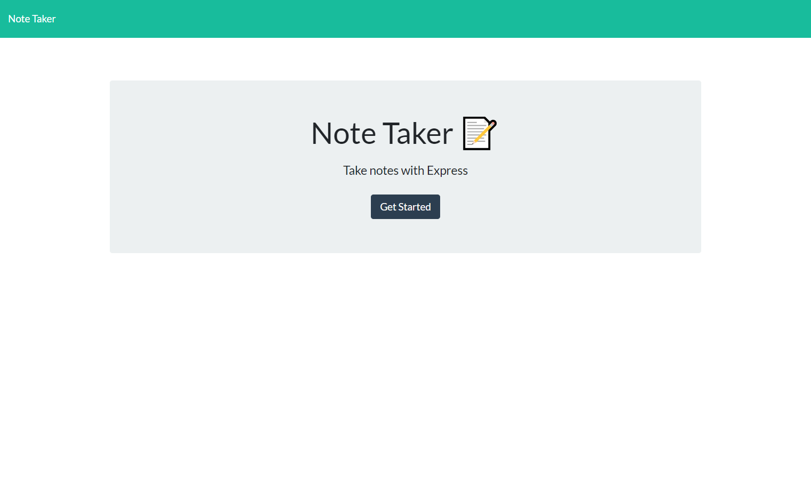
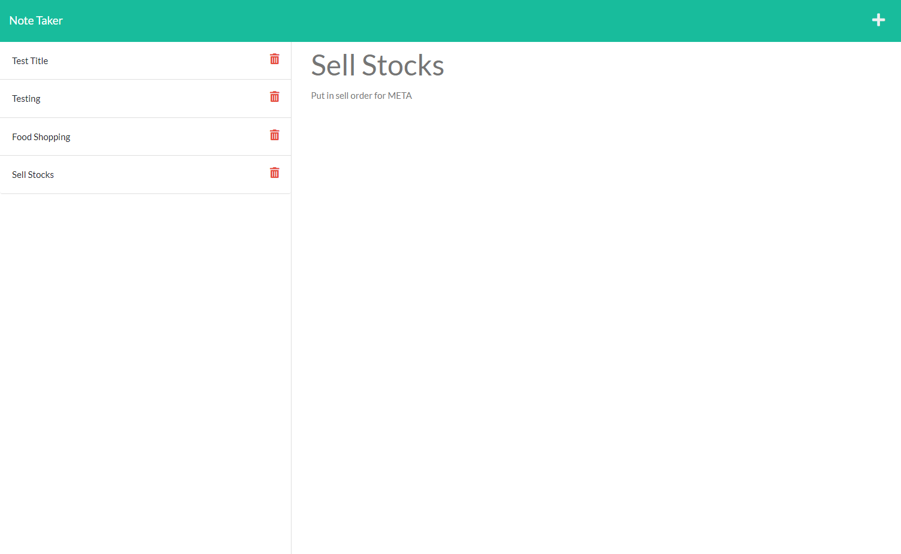

<h1>Note Taker</h1>


## Table of Contents

- [User-Story](#user-story)
- [Description](#description)
- [Installation](#installation)
- [Mock-up](#mock-up)
- [Contributing](#installation)
- [Questions](#questions)

## User Story

```md
AS A small business owner
I WANT to save notes
SO THAT I can organize and keep track of tasks to complete
```

## Description

```md
GIVEN a note-taking application
WHEN I open the homepage
THEN I am taken to the landing page with a link to the notes page
WHEN I click the notes page link
THEN I am presented with existing notes listed in the left-hand 
and empty fields for new notes
WHEN I enter a new note
THEN a save icon appears in the navigation bar
WHEN I click the save icon
THEN the note is saved with other existing notes
WHEN I click on an existing note in the left-hand side
THEN the note appears in the right-hand column
WHEN I click the write icon in the navigation bar
THEN I am presented with empty fields to enter a new note title
```

## Installation

```md
Installation instructions:
node.js, express, heroku
```

## Mock-Up

Homepage



Notes Page


## Contributing

```md
Daniel Merkin contributed to this project.
```

## Questions

```md
Have any questions?
```

Check me out on GitHub! [dmerk2](https://github.com/dmerk2)<br>
Shoot me an email at dan.merkin@gmail.com<br>
Generated with [README-generator](https://github.com/dmerk2/Professional-README-Generator)
